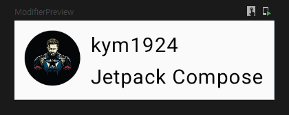

# Jetpack Compose

- A Modern toolkit for building native Android UI.
- Build a UI component with `declarative` functions.
- `Simplifies` and `accelerates` UI development.
  - **Less code.**
  - **Powerful tools.**
  - **Intuitive Kotlin APIs.**

- Do not use **XML layout** and **Layout Editor.**
  - `Composable functions.`
  - `Preview functions.`
  - `Compose compiler will do the rest.`

---

## Lesson 1: Composable functions

- Jetpack Compose is build around **composable functions.**
- These functions let you define your app’s UI **programmatically.**
  - Describing how it should look.
  - Providing data dependencies.
- To create a composable function, just add the `@Composable annotaion` to the function name.

```kotlin
@Composable
fun Greeting(name: String) {
    Text(text = "Hello $name!")
}
```

### Add a text element

- Let's add **"Hello World!"** to the screen **without an XML layout.**
- The `setContent` block defines the activity's layout where **composable functions** are called.
- Composable functions can only be called from other composable functions.

```kotlin
// ComponentActivity.kt
public fun ComponentActivity.setContent(
    parent: CompositionContext? = null,
    content: @Composable () -> Unit
) {
    ...
}

// ui.theme.Theme.kt
@Composable
fun ComposeTheme(
    ...
    content: @Composable () -> Unit
) {
    ...
}

// Surface.kt
@Composable
fun Surface(
    ...
    content: @Composable () -> Unit
) {
    ...
}
```

- Jetpack Compose uses **a Kotlin compiler plugin.**
  - `Transform these composable functions into the app's UI elements.`
  - A `Text` composable function can be thought of as a `TextView.`

```kotlin
@Composable
fun Text(
    text: AnnotatedString,
    ...
) {
    ...
}
```

```kotlin
import android.os.Bundle
import androidx.activity.ComponentActivity
import androidx.activity.compose.setContent
import androidx.compose.foundation.layout.fillMaxSize
import androidx.compose.material3.MaterialTheme
import androidx.compose.material3.Surface
import androidx.compose.material3.Text
import androidx.compose.ui.Modifier
import com.kimym.compose.ui.theme.MyApplicationTheme

class MainActivity : ComponentActivity() {
    override fun onCreate(savedInstanceState: Bundle?) {
        super.onCreate(savedInstanceState)
        setContent {
            ComposeTheme {
                // A surface container using the 'background' color from the theme
                Surface(modifier = Modifier.fillMaxSize(),
                    color = MaterialTheme.colorScheme.background) {
                    Text(text = "Hello World!")
                }
            }
        }
    }
}
```


### Define a composable function

- To make a composable function, add the `@Composble` annotation.

```kotlin
// ...
import androidx.compose.runtime.Composable

class MainActivity : ComponentActivity() {
    override fun onCreate(savedInstanceState: Bundle?) {
        super.onCreate(savedInstanceState)
        setContent {
            ComposeTheme {
                // A surface container using the 'background' color from the theme
                Surface(modifier = Modifier.fillMaxSize(),
                    color = MaterialTheme.colorScheme.background) {
                    Greeting(text = "world!")
                }
            }
        }
    }
}

@Composable
fun Greeting(name: String) {
    Text(text = "Hello $name!")
}
```

### Preview your function in Android Studio

- Can preview easily using a `@Preview` annotation.
  - `Preview function` must be used **without parameters.**

```kotlin
//...
import androidx.compose.ui.tooling.preview.Preview

@Composable
fun Greeting(name: String) {
    Text(text = "Hello $name!")
}

@Preview(showBackground = true)
@Composable
fun DefaultPreview() {
    ComposeTheme {
        Greeting("world!")
    }
}
```


------

## Lesson 2: Layouts

- UI elements are **hierarchical**.
  - Elements contained in **other elements.**
- In Compose, build a UI hierarchy.
  - By calling composable functions from **other composable functions.**

### Add multiple texts

- What if add multiple Text?
  - Let's create a **data class Message** and **@Composable function.**
    - To show the sender and the body.

```kotlin
data class Message(val sender: String, val body: String)

@Composable
fun MessageCard(msg: Message) {
    Text(text = msg.sender)
    Text(text = msg.body)
}

@Preview(showBackground = true)
@Composable
fun MessagePreview() {
    ComposeTheme {
        MessageCard(Message("kym1924", "Jetpack Compose"))
    }
}
```

- How do the two texts appear on the screen?


- Dit it match expectations?
  - Two text elements are **unreadable.**
  - Because haven’t provided any information about **how to arrange them.**

### Using a Column / Row / Box

- The `Column` function arranges elements **vertically.**

```kotlin
import androidx.compose.foundation.layout.Column

@Composable
fun MessageCard(msg: Message) {
    Column {
        Text(text = msg.sender)
        Text(text = msg.body)
    }
}
```


- The `Row` function arranges items **horizontally.**

```kotlin
import androidx.compose.foundation.layout.Row

@Composable
fun MessageCard(msg: Message) {
    Row {
        Text(text = msg.sender)
        Text(text = msg.body)
    }
}
```


- The `Box` function **stacks** elements.

```kotlin
import androidx.compose.foundation.layout.Box

@Composable
fun MessageCard(msg: Message) {
    Box {
        Text(text = msg.sender)
        Text(text = msg.body)
    }
}
```


### Add an image element

- Image composable allows to add images to app.
  - The image source is [here](https://pixabay.com/ko/illustrations/%ec%ba%a1%ed%8b%b4-%ec%95%84%eb%a9%94%eb%a6%ac%ec%b9%b4-%ec%96%b4%eb%b2%a4%ec%a0%80%ec%8a%a4-%eb%a7%88%eb%b8%94-5692937/).

```kotlin
import androidx.compose.foundation.Image
import androidx.compose.ui.res.painterResource

@Composable
fun MessageCard(msg: Message) {
    Row {
        Image(
            painter = painterResource(id = R.drawable.profile_picture),
            contentDescription = "Profile Image Resource"
        )
        Column {
            Text(text = msg.author)
            Text(text = msg.body)
        }
    }
}
```


### Configure your layout

- To decorate or configure a composable, Compose uses `modifiers.`
- They allow to change **the composable’s size, layout, appearance.**
  - High-level interactions such **as making an element clickable.**
  - Can chain them to create richer composables.

```kotlin
import androidx.compose.foundation.layout.Spacer
import androidx.compose.foundation.layout.height
import androidx.compose.foundation.layout.padding
import androidx.compose.foundation.layout.size
import androidx.compose.foundation.layout.width
import androidx.compose.foundation.shape.CircleShape
import androidx.compose.ui.Modifier
import androidx.compose.ui.draw.clip
import androidx.compose.ui.unit.dp

@Composable
fun MessageCard(msg: Message) {
    // Add padding around our message
    Row(modifier = Modifier.padding(all = 8.dp)) {
        Image(
            painter = painterResource(id = R.drawable.profile_picture),
            contentDescription = "Profile Image Resource",
            modifier = Modifier
                // Set Image size to 40dp
                .size(40.dp)
                // Clip image to be shaped as a circle
                .clip(CircleShape)
        )
        // Add a horizontal space between the image and the column
        Spacer(modifier = Modifier.width(8.dp))

        Column {
            Text(text = msg.sender)
            // Add a vertical space between the author and message texts
            Spacer(modifier = Modifier.height(4.dp))
            Text(text = msg.body)
        }
    }
}
```



---

## Lesson 3: Material Design

- Compose is built to support Material Design principles.

### Use Material Design

- Improve the appearance of our MessageCard composable using **Material Design styling**.
- To start, wrap the MessageCard composable.
  - With the `ComposeTheme` and `Surface.`
    - ComposeTheme can be found at **ui.theme.Theme.kt.**
    - The name(ComposeTheme) may vary **depending on the project name.**

```kotlin
@Preview(showBackground = true)
@Composable
fun ModifierPreview() {
    ComposeTheme {
        Surface {
            MessageCard(Message("kym1924", "Jetpack Compose"))
        }
    }
}
```


- Material Design is built around three pillars: `Color`, `Typography`, and `Shape.`

### Color

- Use `MaterialTheme.colorScheme` to style with colors from the wrapped theme.

```kotlin
// ...
import androidx.compose.foundation.border
import androidx.compose.material3.MaterialTheme

@Composable
fun MessageCard(msg: Message) {
    Row(modifier = Modifier.padding(all = 8.dp)) {
        Image(
            painter = painterResource(id = R.drawable.profile_picture),
            contentDescription = "Profile Image Resource",
            modifier = Modifier
                .size(40.dp)
                .clip(CircleShape)
            	// Add a border to the image.
                .border(1.5.dp, MaterialTheme.colorScheme.primary, CircleShape)
        )
        Spacer(modifier = Modifier.width(8.dp))

        Column {
            Text(
                text = msg.sender,
                // Add color to text.
                color = MaterialTheme.colorScheme.secondary
            )
            Spacer(modifier = Modifier.height(4.dp))
            Text(text = msg.body)
        }
    }
}
```


### Typography

- Use `MaterialTheme.typography` to Typography with colors from the wrapped theme.

```kotlin
@Composable
fun MessageCard(msg: Message) {
    Row(modifier = Modifier.padding(all = 8.dp)) {
        Image(
            painter = painterResource(R.drawable.profile_picture),
            contentDescription = "Profile Image Resource",
            modifier = Modifier
                .size(40.dp)
                .clip(CircleShape)
                .border(1.5.dp, MaterialTheme.colorScheme.primary, CircleShape)
        )
        Spacer(modifier = Modifier.width(8.dp))

        Column {
            Text(
                text = msg.sender,
                color = MaterialTheme.colorScheme.secondary,
                // Add style to text.
                style = MaterialTheme.typography.titleSmall
            )

            Spacer(modifier = Modifier.height(4.dp))

            Text(
                text = msg.body,
               	// Add style to text.
                style = MaterialTheme.typography.bodyMedium
            )
        }
    }
}
```


### Shape

- With `Shape` can add the final touches.

```kotlin
// ...
import androidx.compose.material3.Surface

@Composable
fun MessageCard(msg: Message) {
    Row(modifier = Modifier.padding(all = 8.dp)) {
        Image(
            painter = painterResource(R.drawable.profile_picture),
            contentDescription = "Profile Image Resource",
            modifier = Modifier
                .size(40.dp)
                .clip(CircleShape)
                .border(1.5.dp, MaterialTheme.colorScheme.primary, CircleShape)
        )
        Spacer(modifier = Modifier.width(8.dp))

        Column {
            Text(
                text = msg.sender,
                color = MaterialTheme.colorScheme.secondary,
                style = MaterialTheme.typography.titleSmall
            )

            Spacer(modifier = Modifier.height(4.dp))
			
            // A shape can be applied to the surface.
            Surface(shape = RoundedCornerShape(12.dp), shadowElevation = 1.dp) {
                Text(
                    text = msg.body,
                    modifier = Modifier.padding(all = 4.dp),
                    style = MaterialTheme.typography.bodyMedium
                )
            }
        }
    }
}
```


### Enable dark theme

- Dark theme(or night mode) can be enabled to avoid a bright display.
  - At night.
  - To save the device battery.
- Thanks to the Material Design support, Jetpack Compose can handel the dark theme by default.

```kotlin
@Composable
fun MessageCard(msg: Message) {
    Row(modifier = Modifier.padding(all = 8.dp)) {
        Image(
            painter = painterResource(R.drawable.profile_picture),
            contentDescription = "Profile Image Resource",
            modifier = Modifier
                .size(40.dp)
                .clip(CircleShape)
                .border(1.5.dp, MaterialTheme.colorScheme.primary, CircleShape)
        )
        Spacer(modifier = Modifier.width(8.dp))

        Column {
            Text(
                text = msg.sender,
                color = MaterialTheme.colorScheme.secondary,
                style = MaterialTheme.typography.titleSmall
            )

            Spacer(modifier = Modifier.height(4.dp))

            Surface(
                shape = RoundedCornerShape(12.dp),
                border = BorderStroke(1.dp, MaterialTheme.colorScheme.outline),
                shadowElevation = 1.dp
            ) {
                Text(
                    text = msg.body,
                    modifier = Modifier.padding(all = 4.dp),
                    style = MaterialTheme.typography.bodyMedium
                )
            }
        }
    }
}
```

- And can create **multiple previews.**
  - Separate functions.
  - Add multiple annotations to the same function.

```kotlin
import android.content.res.Configuration

@Preview(name = "Light Mode")
@Preview(
    uiMode = Configuration.UI_MODE_NIGHT_YES,
    showBackground = true,
    name = "Dark Mode"
)
@Composable
fun DarkModePreview() {
    ComposeTheme {
        Surface {
            MessageCard(
                msg = Message("kym1924", "Jetpack Compose")
            )
        }
    }
}
```


----

## Lesson 4: Lists and animations

### Create a list of messages

- Previously, `RecyclerView` was used to display a list on the screen.
  - **Adapter, ViewHolder, DiffUtil** were also created to use RecyclerView.
- In compose, list can be expressed simply by using `LazyColumn` and `LazyRow.`
  - [SampleData](https://gist.github.com/yrezgui/26a1060d67bf0ec2a73fa12695166436) is here.

```kotlin
import androidx.compose.foundation.lazy.items
import androidx.compose.foundation.lazy.LazyColumn

@Composable
fun Conversation(messages: List<Message>) {
    LazyColumn {
        items(messages) { message ->
            MessageCard(message)
        }
    }
}

@Preview(showBackground = true)
@Composable
fun LazyColumnPreview() {
    ComposeTheme() {
        Conversation(SampleData.sample)
    }
}
```


### Animate messages while expanding

- In Compose, animation can also be implemented easily.
- Let's expand the message to show it longer, and apply an animation when it expands.

- First, need to know if the message is in an expanded **state** or not.
- Second, because the state changes, need to **detect the state change.**
  - `remember`
    - Save local state in memory.
  - `mutableStateOf`
    - Track changes to the value passed to mutableStateOf.
- Use the `animateColorAsState` function.
  - surfaceColor will be updated gradually.
- Use the `animateContentSize().`
  - container size will be updated smoothly.

```kotlin
// ...
import androidx.compose.foundation.clickable
import androidx.compose.runtime.getValue
import androidx.compose.runtime.mutableStateOf
import androidx.compose.runtime.remember
import androidx.compose.runtime.setValue

@Composable
fun MessageCard(msg: Message) {
    Row(modifier = Modifier.padding(all = 8.dp)) {
        Image(
            painter = painterResource(R.drawable.profile_picture),
            contentDescription = "Profile Image Resource",
            modifier = Modifier
                .size(40.dp)
                .clip(CircleShape)
                .border(1.5.dp, MaterialTheme.colorScheme.primary, CircleShape)
        )
        Spacer(modifier = Modifier.width(8.dp))

        // Keep track if the message is expanded or not
        var isExpanded by remember { mutableStateOf(false) }
        // surfaceColor will be updated gradually from one color to the other
        val surfaceColor by animateColorAsState(
            targetValue = if (isExpanded) MaterialTheme.colorScheme.primary else MaterialTheme.colorScheme.surface
        )
        // Toggle the isExpanded variable when we click on this Column
        Column(modifier = Modifier.clickable { isExpanded = !isExpanded }) {
            Text(
                text = msg.sender,
                color = MaterialTheme.colorScheme.secondary,
                style = MaterialTheme.typography.titleSmall
            )

            Spacer(modifier = Modifier.height(4.dp))

            Surface(
                shape = RoundedCornerShape(12.dp),
                shadowElevation = 1.dp,
                // surfaceColor color will be changing gradually from primary to surface
                color = surfaceColor,
                // animateContentSize will change the Surface size gradually
                modifier = Modifier
                    .animateContentSize()
                    .padding(1.dp)
            ) {
                Text(
                    text = msg.body,
                    modifier = Modifier.padding(all = 4.dp),
                    // It the message is expanded, display all content otherwise first line.
                    maxLines = if (isExpanded) Int.MAX_VALUE else 1,
                    style = MaterialTheme.typography.bodyMedium
                )
            }
        }
    }
}
```


